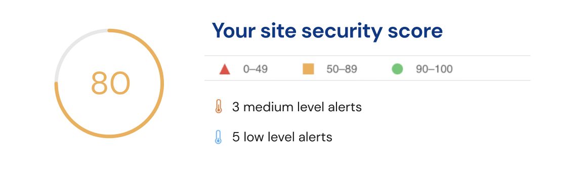
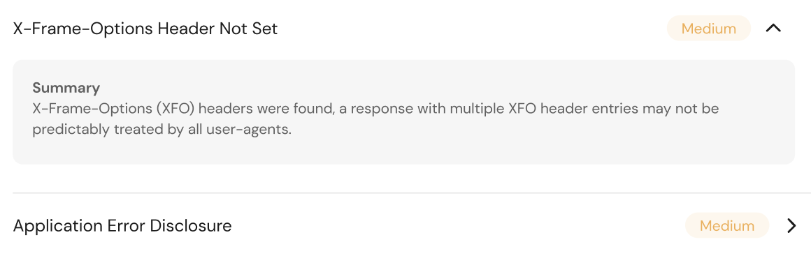

# FortNynja Frontend Assignment

## Design

Create a HTML page that contains the following sections:

**Report Summary:**



**Alert Description:**



**Suggested layout:**

You can choose to use this suggested layout in Figma, or design your own. The only requirements are to translate the Summary and Alert Description designs as closely as possible.

[https://www.figma.com/file/Dpx64IrwRjJnXJaHs9xO4F/FortNynja-Frontend-Assignment?node-id=0%3A1](https://www.figma.com/file/Dpx64IrwRjJnXJaHs9xO4F/FortNynja-Frontend-Assignment?node-id=0%3A1)

---

## Assignment Requirements

### Data

- The report data is served by a local HTTP server listening on `http://127.0.0.1:3000`. There are 2 endpoints:
  - `http://127.0.0.1:3000/report` returns report data. This data contains the alert descriptions for both `business` and `technical` preferences.
  - `http://127.0.0.1:3000/user` returns user settings. The object contains the `preferredReportType` field which may be either `business` or `technical`. Use this field to determine user preferences for alert description display.
- Data fixtures are defined in `./server/db.js`. Do not modify them.
- The server is configured to respond with HTTP error 500 randomly. Your application should handle this error should it occur.
- Use this data to render the report as specified in the design.

### UI

- Translate the design as closely as possible to custom CSS.
- Use SVGs for the icons. You can grab them from the Figma design.
- In the Summary section, the security score can be calculated with the following algorithm:
  - Score starts at 100 points.
  - If a high level alert is found, deduct 10 points.
  - If a medium level alert is found, deduct 5 points.
  - If a low level alert is found, deduct 1 point.
  - The lowest possible security score is 0 point.
  - For example, if the report has 3 medium and 5 low level alerts, then the security score will be 100 - (3\*5) - (5\*1) = 80.
- Make sure that alert descriptions are displayed based on user settings (either as `business` or `technical`).
- Alert colors:
  - High level alert - `#2f1918`
  - Medium level alert - `#F3AE4E`
  - Low level alert - `#28AAE1`
- Security score colors:
  - 90-100: `#16291a`
  - 50-89: `#F3AE4E`
  - 0-49: `#2f1918`

### Interactions

- Provide an user interface (eg. a button) to generate the report in PDF format. You don't have to implement the PDF generation feature (bonus points if you do), showing something in the console when the user interface is interacted is sufficient.

### Testing

- A placeholder test file `ScanReport.spec.js` has been created for you. Please add some automated test scenario that makes sense to you.
- **Hint:** The security score calculation is a good candidate to write tests on to ensure the calculation is correct.

### Other Notes

- **Clone** the repo (not fork) to a private repository to get started. Please don't push everything in one commit. We would love to see how you structure your commits.
- Feel free to use a framework of your choice. This assignment was created in Vue.js, but you can choose any framework you feel most comfortable with.
- Don't feel like you have to stay within the placeholder files. If you want to create some helper/utility functions, go ahead and create the appropriate file/folders for that.
- Feel free to use any tool, library or tune the project (including the setup files) to fit your needs.
- If you see any elements of this Report design that could be useful to re-use in other areas, feel free to split them out into their own subcomponents. We like to see how you would structure your components.
- If you are unclear about something or want to run something by the team, please feel free to reach out. We like to get a sense of how you would work/collaborate on a real task.
- Send us over the GitHub URL when you are complete so we can check it out!

---

## Project setup

### (Optional) Install `nvm`

We use [nvm](https://github.com/nvm-sh/nvm) to manage our Node.js versions. Once installed, run `nvm use` in the root directory to use the Node.js version defined in `.nvmrc`.

### Install dependencies

```
npm install
```

### Compile and hot-reload for development

```
npm run serve
```

### Run unit tests

```
npm run test:unit
```
